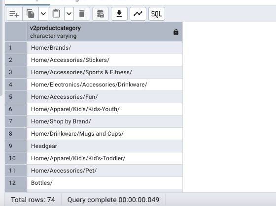
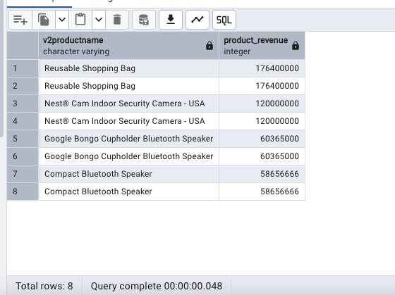

Question 1: 

Find the distinct product category

```
SELECT Distinct (v2productcategory)
FROM 
    all_sessions
````


Answer: 




Question 2: 
Find each unique product viewed by each visitor

SQL Queries:

Answer:


Question 3: generate a list of top-revenue products

SQL Queries:
```
WITH CTE AS (
SELECT 
	V2productname,
	COALESCE(CAST(productrevenue AS INTEGER),0) AS product_revenue 
FROM 
	all_sessions
)
SELECT 
	*
FROM 
	cte
WHERE 
	product_revenue > 0
ORDER BY
	product_revenue DESC
```

Answer:



